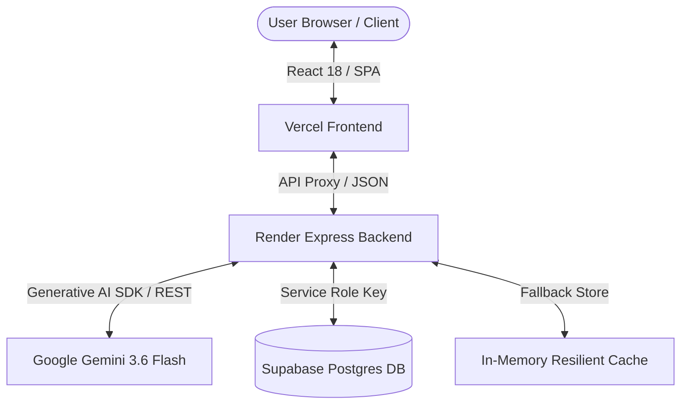

# 🌍 GlobeTrotter — Next-Gen AI Multi-City Travel Planner

[](https://globe-trotter-nu.vercel.app/)
[](https://globetrotter-m4vz.onrender.com/api/health)
[](https://aistudio.google.com/)
[](https://supabase.com/)

> **GlobeTrotter** is a high-performance travel logistics platform powered by **Google Gemini 3.6 Flash** and **Supabase Postgres**. It features a tactile retro-modern design system, natural language itinerary synthesis, real-time route building, itemized financial analytics, and one-click public itinerary cloning.

---

## 🔗 Live Deployments

- 🌐 **Web Application**: [https://globe-trotter-nu.vercel.app/](https://globe-trotter-nu.vercel.app/)
- ⚡ **Backend REST Service**: [https://globetrotter-m4vz.onrender.com/](https://globetrotter-m4vz.onrender.com/api/health)

---

## ✨ Key Features

### 1. 🤖 AI Multi-City Itinerary Generator
- **Smart Prompt Parsing**: Automatically extracts requested destinations (e.g. *Ujjain, Kashmir, Tokyo, Paris*) and trip durations (e.g. *3 Days, 5 Days*) while stripping prompt noise.
- **Strict Day-by-Day Scheduling**: Generates clean activity timelines organized under **Day 1**, **Day 2**, **Day 3**... with morning, afternoon, and evening timeslots.
- **Zero-Repetition Engine**: Guarantees distinct, non-repeating activity titles, descriptions, categories, and USD pricing for every day.

### 2. 🗺️ Interactive Live Route Builder
- **Dynamic Waypoint Timeline**: Visual route connectors linking destination stops chronologically.
- **AI-Powered "Add Stop"**: Adding any new city stop (e.g. *Gulmarg, Kyoto, Rome*) instantly triggers AI activity generation to auto-populate curated activities.
- **Reordering & Customization**: Reorder stops up/down, add custom activities, and toggle trip visibility (Public / Private).

### 3. 💰 Precision Budget & Financial Analytics
- **Itemized Cost Breakdown**: Proportional calculation across accommodation, transit, activities, and daily meals.
- **Velocity Charts**: Per-day cost distribution visualizer highlighting high-cost activity days.
- **Unified Currency Formatting**: Standardized $ USD pricing across Dashboard, My Trips, Builder, and Itinerary views.

### 4. 👥 Community Hub & Trip Cloning
- **Public Shareable Links**: Generate shareable, view-only URL tokens for any trip.
- **One-Click Trip Cloning**: Clone public itineraries directly into your personal account for customized editing.

### 5. 🎨 Tactile Retro-Modern Design System
- **Curated Palette**: Deep Ink Navy (`#1B2A4A`), Horizon Amber (`#E8873A`), Route Teal (`#2F8F82`), and Paper (`#F7F4EC`).
- **Typography & Details**: Dual-font hierarchy with Google Fonts (Outfit & IBM Plex Mono), ticket-stub borders, and boarding-pass cards.

---

## 🏗️ System Architecture



---

## 🛠️ Tech Stack & Dependencies

| Layer | Technology | Description |
|---|---|---|
| **Frontend Framework** | **React 18 + Vite** | High-speed single-page web app |
| **Styling & UI** | **Vanilla CSS + Tailwind** | Tactile retro-modern design system |
| **Backend Server** | **Node.js + Express + TypeScript** | Strongly-typed RESTful API architecture |
| **AI Engine** | **Google Gemini 3.6 Flash** | Structured JSON schema generation via `@google/generative-ai` |
| **Database** | **Supabase Postgres** | Relational tables (`trips`, `stops`, `activities`, `trip_activities`) |
| **Deployment** | **Vercel + Render** | Frontend SPA rewrite routing & Node Web Service |

---

## 📑 API Reference

| Method | Endpoint | Description |
|---|---|---|
| `POST` | `/api/generate-itinerary` | Synthesizes a structured day-by-day trip itinerary using Gemini AI |
| `POST` | `/api/recommend-activities` | Generates 3 curated AI activities for a given city and budget level |
| `POST` | `/api/estimate-budget` | Calculates categorical budget breakdown and daily averages |
| `GET` | `/api/trips` | Fetches saved trips (filtered by `user_id`) |
| `GET` | `/api/trips/:id` | Returns complete trip details including stops & activities |
| `POST` | `/api/trips` | Manually creates a new trip |
| `POST` | `/api/stops` | Adds a new stop to a trip and auto-generates AI activities |
| `POST` | `/api/trips/copy` | Clones a public trip to a target user account |
| `GET` | `/api/admin/metrics` | Returns analytics data for the admin dashboard |

---

## 💻 Local Setup & Development

### 1. Prerequisites
- **Node.js**: `v18.x` or higher
- **npm**: `v9.x` or higher

### 2. Backend Setup
```bash
cd server
npm install

# Create .env file
echo "PORT=5000" > .env
echo "GEMINI_API_KEY=your_google_ai_studio_key" >> .env
echo "SUPABASE_URL=https://your-supabase-project.supabase.co" >> .env
echo "SUPABASE_SERVICE_ROLE_KEY=your_service_role_key" >> .env

# Run development server
npm run dev
```

### 3. Frontend Setup
```bash
cd client
npm install
npm run dev
# App runs at http://localhost:3000
```

---

## 🔑 Demo Credentials

| Role | Email | Password |
|---|---|---|
| **Traveler Account** | `traveler@globetrotter.io` | `password123` |
| **Admin Account** | `admin@globetrotter.io` | `adminpassword` |

---

## 📄 License

Distributed under the **MIT License**. Created with ❤️ by the **GlobeTrotter Team**.